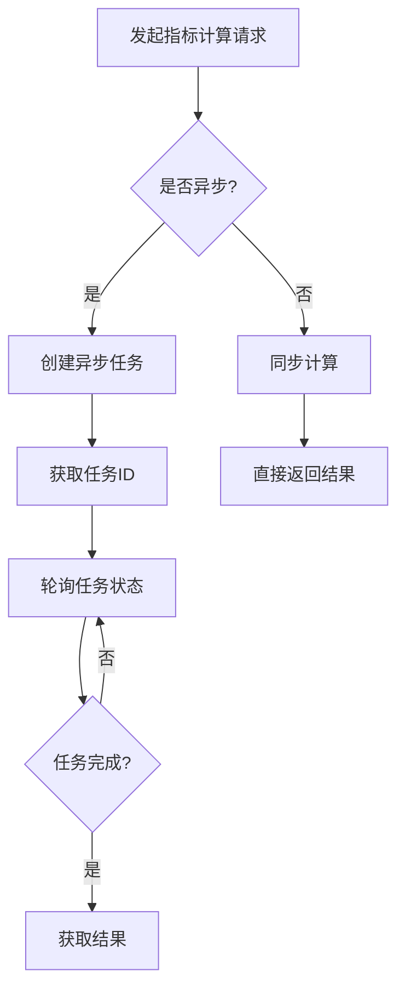

# 股票技术指标计算API

版本: 1.0.0

生成时间: 2025-12-21 21:02:36

---

## 概述

本API提供股票技术指标计算服务，支持多种技术指标和异步计算。

## 快速开始

### 1. 启动服务器
```bash
python scripts/start_api_server.py
```

### 2. 获取可用指标
```bash
curl http://127.0.0.1:8000/indicators/available
```

### 3. 计算指标
```bash
curl -X POST http://127.0.0.1:8000/indicators/calculate \
  -H 'Content-Type: application/json' \
  -d '{
    "symbol": "sh600519",
    "indicators": ["moving_average", "rsi"],
    "start_date": "2024-01-01",
    "end_date": "2024-01-31"
  }'
```

## API端点

## 数据模型

### IndicatorRequest

指标计算请求

**字段**:
| 字段名 | 类型 | 必填 | 描述 |
|--------|------|------|------|
| symbol | `string` | 否 | 股票代码，如：sh600519 |
| indicators | `array` | 否 | 指标名称列表 |
| start_date | `string` | 否 | 开始日期，格式：YYYY-MM-DD |
| end_date | `string` | 否 | 结束日期，格式：YYYY-MM-DD |
| use_cache | `boolean` | 否 | 是否使用缓存 |

### ValidationRequest

验证请求

**字段**:
| 字段名 | 类型 | 必填 | 描述 |
|--------|------|------|------|
| symbol | `string` | 否 | 股票代码 |
| indicator | `string` | 否 | 指标名称 |
| start_date | `string` | 否 | 开始日期 |
| end_date | `string` | 否 | 结束日期 |

### CalculationStatus

计算状态

**字段**:
| 字段名 | 类型 | 必填 | 描述 |
|--------|------|------|------|

## 错误处理

### 常见错误码
| 状态码 | 描述 |
|--------|------|
| 200 | 成功 |
| 400 | 请求参数错误 |
| 404 | 资源不存在 |
| 500 | 服务器内部错误 |

### 错误响应格式
```json
{
  "success": false,
  "error": {
    "type": "ValidationError",
    "message": "Invalid parameter",
    "details": {
      "field": "start_date",
      "issue": "Must be a valid date"
    }
  }
}
```

## 使用指南

### 1. 指标计算流程


### 2. 参数配置建议
- **移动平均线**: 常用周期 [5, 10, 20, 30, 60]
- **RSI**: 默认周期14，超买线70，超卖线30
- **MACD**: 默认参数 (12, 26, 9)
- **数据要求**: 至少需要20个交易日数据

### 3. 性能优化建议
- 启用缓存减少重复计算
- 使用异步计算处理大批量数据
- 合理设置查询日期范围
- 批量查询减少API调用次数

## 附录

### A. 可用指标列表
| 指标名称 | 类型 | 描述 |
|----------|------|------|
| moving_average | 趋势 | 移动平均线 |
| macd | 趋势 | 指数平滑异同移动平均线 |
| parabolic_sar | 趋势 | 抛物线指标 |
| ichimoku_cloud | 趋势 | 一目均衡表 |
| rsi | 动量 | 相对强弱指数 |
| stochastic | 动量 | 随机指标 |
| cci | 动量 | 商品通道指数 |
| williams_r | 动量 | 威廉指标 |
| bollinger_bands | 波动率 | 布林带 |
| obv | 成交量 | 能量潮指标 |

### B. 更新日志
| 版本 | 日期 | 更新内容 |
|------|------|----------|
| 1.0.0 | 2025-12-21 | 初始版本发布 |